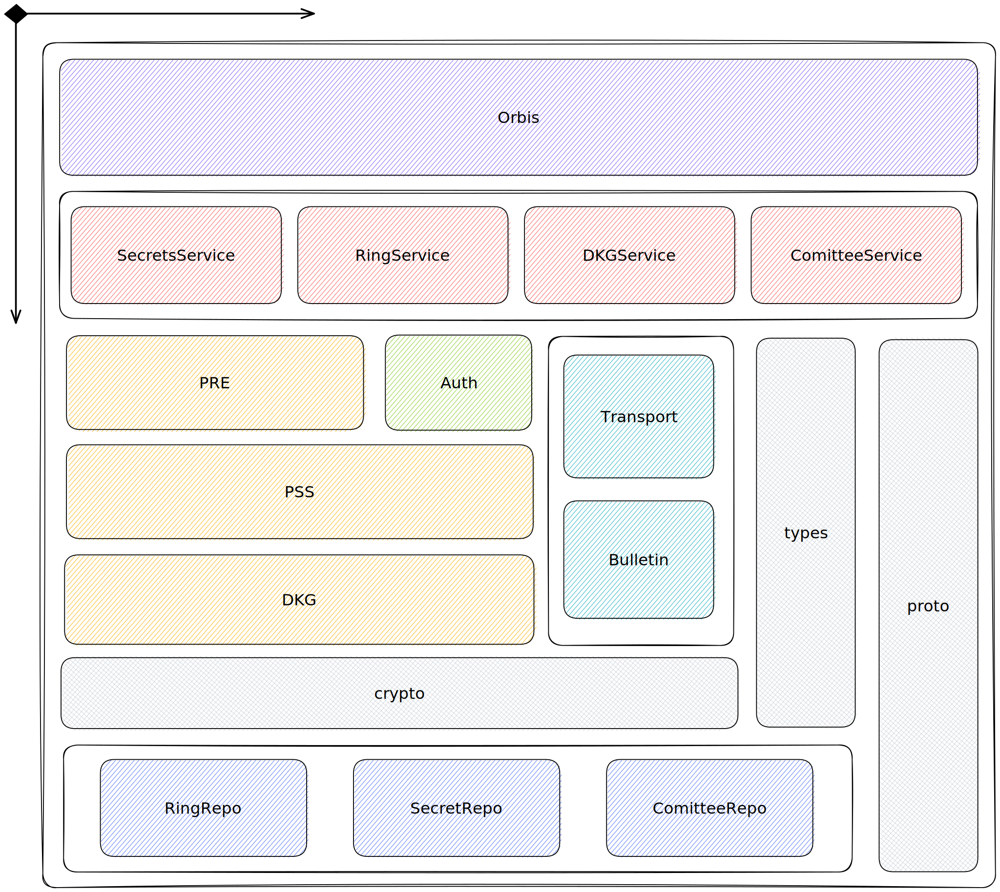

# Orbis - Secrets Management Engine

Orbis is a hybrid secrets management engine designed as a decentralized custodial system. A hybrid decentralizec custodial system is one where it acts as a single "custodial" service that is the owner and authority of a secret, but is maintained by a decentralized group of actors. Any one actor in the system is unable to recover or access the owned secret, instead a threshold number of actors is required to coordinate to recover the managed secret.

However, instead of directly recovering the secret, which would reveal the plaintext to the actors in the system, instead, we apply a form of encryption that prohibits the system from *ever* accessing the plaintext of your secret, called Proxy Re-Encryption (PRE). PRE Translates encrypted ciphertext from one public key to another without exposing the plaintext.

## Status

## Secret Ring

## MPC
The core design of Orbis relies on a various kinds of Multi Party Computation (MPC) systems.

### DKG
Distributed Key Generation

### PSS
Proactive Secret Sharing

### PRE
Proxy Re-Encryption

## Architecture

### Diagram

### Packages

- `/orbis` - Top level entry that combines all the sub packages into a single coherent system.
- `/pkg`
  - `/auth`
  - `/bulletin`
  - `/config`
  - `/crypto`
  - `/db`
  - `/pre`
  - `/pss`
  - `/service`
  - `/transport`
  - `/types`
- `/proto`
- `/gen`